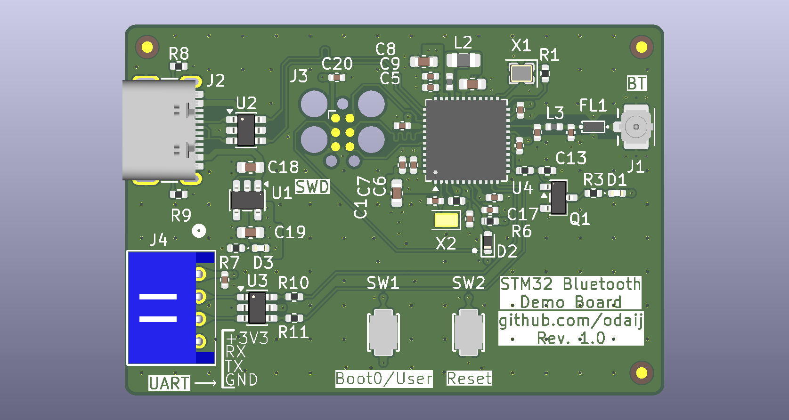

# STM32 Bluetooth Demo Board

## Overview

A demo board I made as a project to learn PCB design fundamentals. The board is missing
some key features that make it general purpose; like headers for the unused MCU pins, however, it was a fun little project that took me a few months :)

This board was designed according to Phil's Lab's amazing videos on YouTube.

Click here to view it on 

## Notes

Assembly PDFs are broken - KiCad won't export them correctly for some reason.
